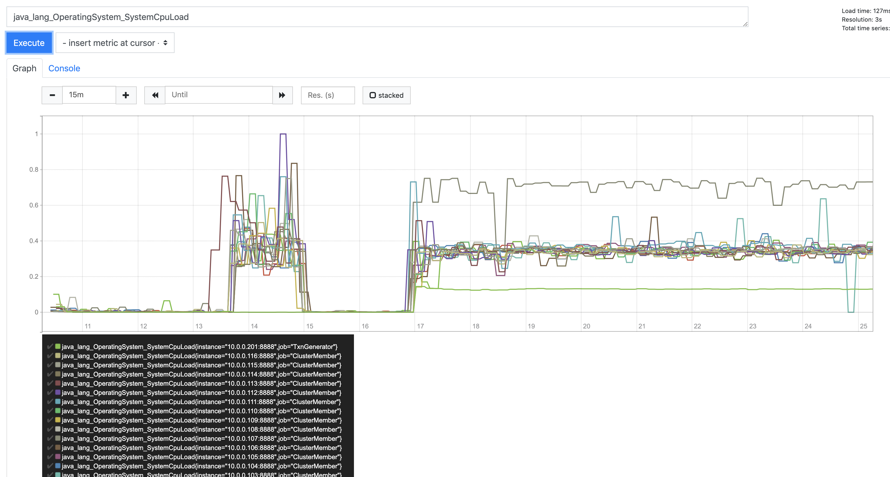

#### Is Networking a limiting factor ? No

Another possible culprit could be a limitation of networking. Since each transaction is 100 bytes, 130kTPS = 13mBytes/sec ~ 130mbits/second.  Nowhere near the network capacity which must be at least 1 gigabit/sec.

However, comparing packets/second and bytes/second reveals data out rate of 700M bytes/sec and 3M packets/second meaning packets are on average about 233 bytes, which is quite small.


#### Investigation: Can the transactions be distributed to the cluster members any faster ?

A "no op" entry processor was implemented and the throughput measured.  This showed that there is still some room for improvement.  The throughput was about 187k TPS on a 16 node cluster.





The transaction source was fully utilizing 1 CPU so this probably represents a limit to the throughput using a single Transaction Source.

#### how fast can transactions be processed, ignoring network ? 

A single thread running on a laptop can do 10k - 20k TPS.  See [ProcessingTimeTest.java](src/test/java/ProcessingTimeTest.java).  Sample output is below.

```
Processed 10000 transactions in 698ms. Single thread speed limit is 14326 tps
```


#### What is the Round Trip Time between servers in the AWS VPC ?

Roughly .15ms based on [this simple test program](src/main/java/com/hazelcast/certification/util/TestClient.java).  Sample output is below:

```
Put 10000 entries in 1542ms.  Estimated RTT is 0.154200ms.
```

Note that "ping" does not work in the AWS VPC.  Note also that , while .15ms is fast, processing one transaction takes around .07ms or half the round trip time. 

_If transactions are delivered one at a time to the correct data node for processing, then this result suggest that there should be 3x as many client threads (i.e. the threads that deliver the request) as worker threads._

