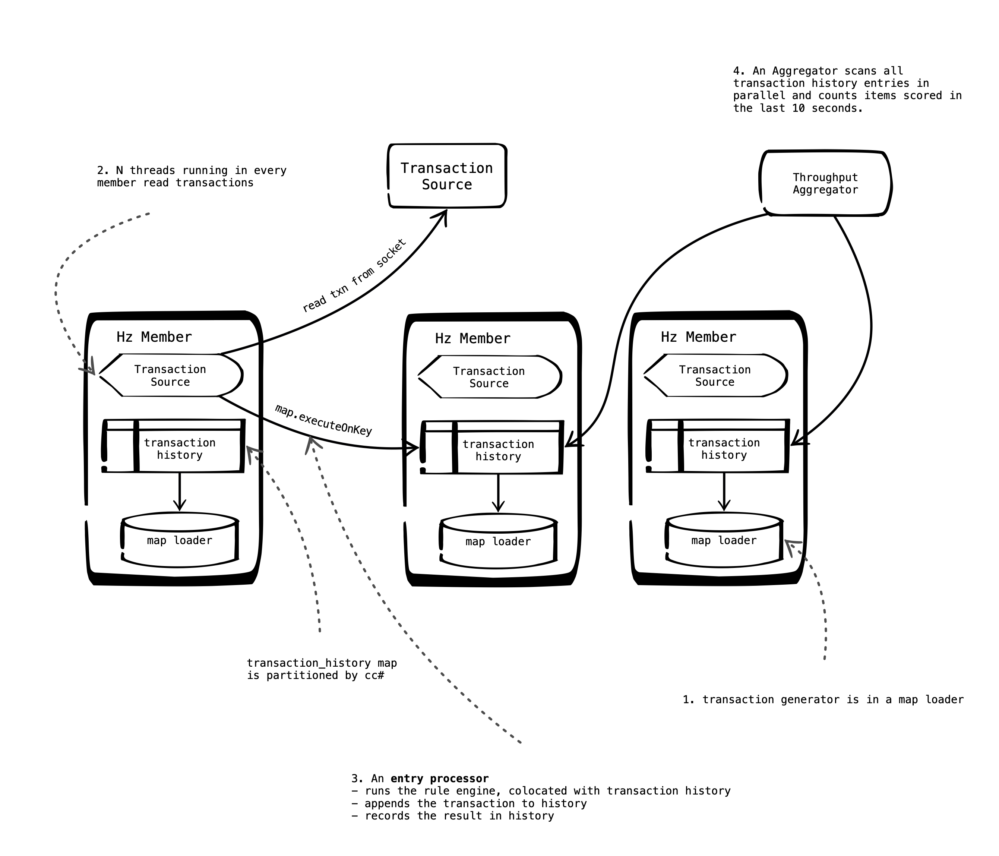
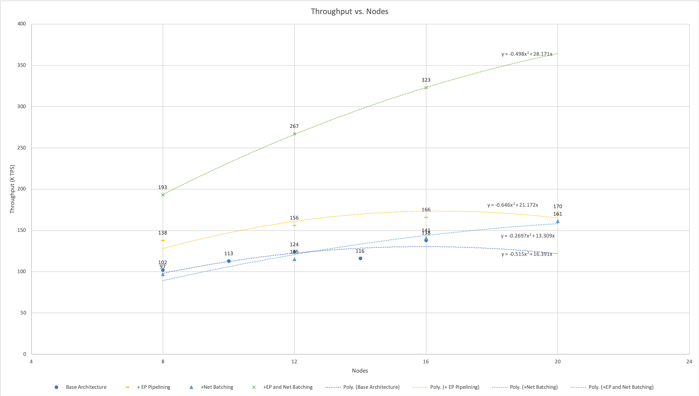
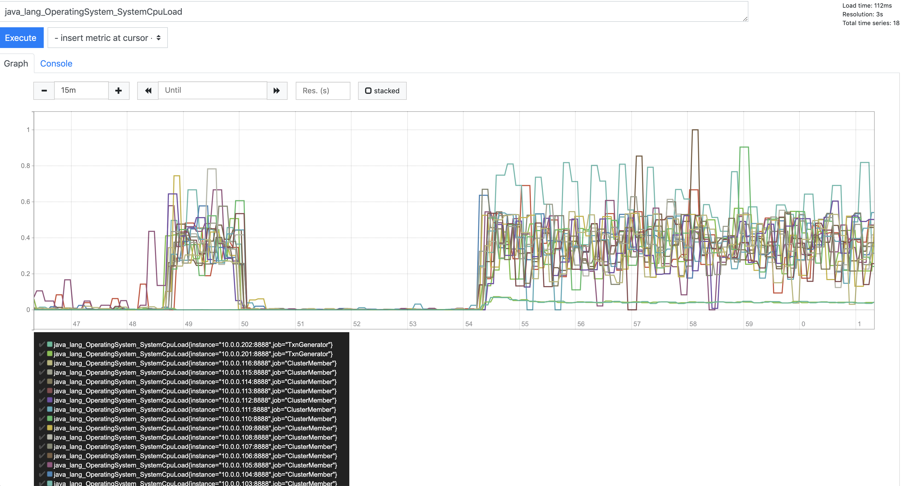
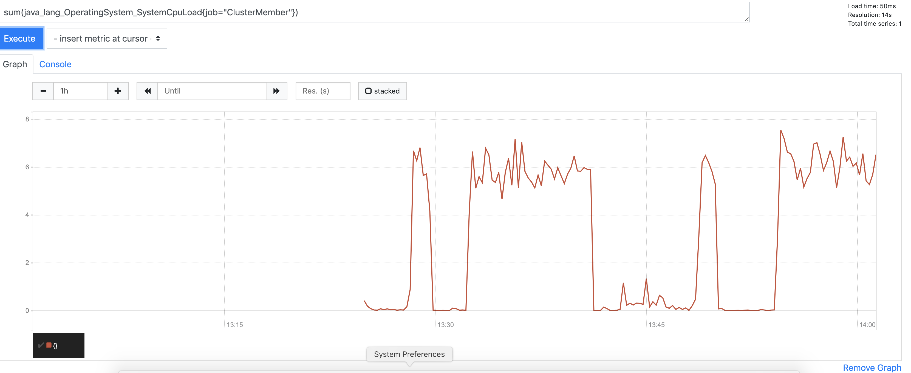
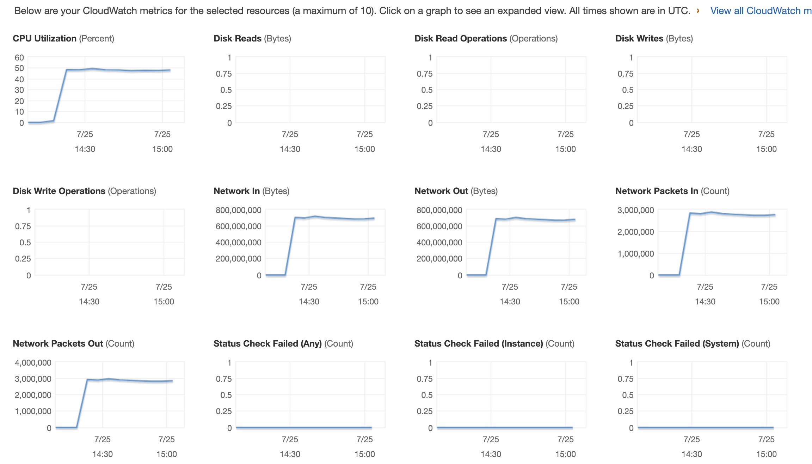
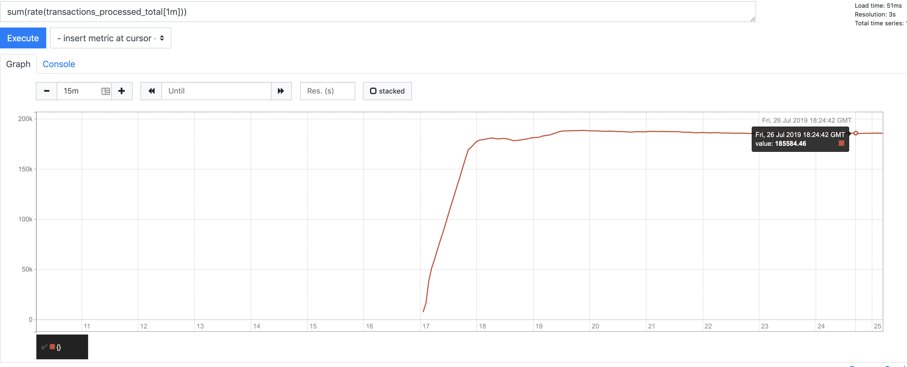
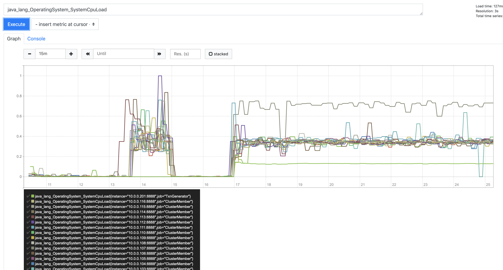

# Certification Problem Overview

The problem is to build a system that scores credit card transactions using the provided rule engine and transaction generation code.  

_Based on the [original project](https://github.com/hazelcast/hazelcast-certification), the challenge has been implemented  as a streaming" system, not a request-response system._ In other words, there is no "scoring service".  Instead, as in the original solution, transactions are pulled from a transaction source, evaluated for fraud and the result is recorded within the system.

The following additional requirements are also understood:

- The solution must be fault tolerant.  This is of course the source of much difficulty.  The original system is very fast and efficient but it does not back up its data anywhere so it is not fault tolerant.
- The solution must be scalable both in terms of the number of credit cards in the system and the capacity to score transactions.  Again, the original solution is restricted to one machine and does not have these qualities.

# Solution Architecture



1. The central data structure is the "transaction_history" map.  The key is credit card number and the value is a LinkedList<Transaction> comprising the credit card's recent transaction history.  The [original transaction generator](hazelcast-certification/src/main/java/com/hazelcast/certification/util/TransactionsUtil.java) has been incorporated into a [map loader](hazelcast-certification/src/main/java/com/hazelcast/certification/util/TransactionMapLoader.java).  This is used to load the history in a distributed manner.  30 million credit cards with 20 historical transactions each takes a few minutes to load using this approach.
2. Each [hazelcast member](hazelcast-certification/src/main/java/com/hazelcast/certification/server/FraudDetectionServer.java) is also running a configurable number of [transaction reader threads](hazelcast-certification/src/main/java/com/hazelcast/certification/server/TransactionSource.java)that pull a transaction from the [transaction source](hazelcast-certification/src/main/java/com/hazelcast/certification/util/TransactionsGenerator.java), ascertains the credit card number, and invokes an [entry processor](hazelcast-certification/src/main/java/com/hazelcast/certification/server/ProcessTransactionEntryProcessor.java) on the appropriate key.
3. The  [entry processor](hazelcast-certification/src/main/java/com/hazelcast/certification/server/ProcessTransactionEntryProcessor.java) does the following.  Obtain the transaction history from the "transaction_history" map. Execute the rule engine.  Record the result (fraudulent or not) back onto the transaction along with a timestamp and the rule that it failed on.  The newest transaction is added to the list and the oldest is removed.
4. To ascertain the throughput, a [fast aggregator](hazelcast-certification/src/main/java/com/hazelcast/certification/util/StatsAggregator.java) is used.  It scans all transaction histories in reverse order, accumulating the number of transactions scored and stopping when it reaches a transaction that was scored more than 10 seconds ago.  On the full 30 million cards (each with 20 historical transactions) this runs in a few seconds with no obvious impact on CPU. 

__Additional Optimization and Notes__

- The most important architectural priority was to use Entry Processors.  The main idea is to have the workload run within entry processors because of the following benefits:  
  - all data access is local
  - even the data that changes does not have to be replicated thanks to backup entry processors.
  - the work will automatically leverage the data colocated work queues and thread pools built into the Hazelcast partition threading model.  The number of independent worker threads can be set directly using the "hazelcast.operation.thread.count" property.
- The data in the transaction history is stored in OBJECT format to avoid repeated serialization / deserialization of the large transaction history lists.  HD memory was not used because  the cost of deserializing the whole transaction list to process one transaction was assumed to be too high.  Also, in the current solution there is no sign of GC stress.
- Use of Entry Processors precluded storing the data in a MultiMap, something which I otherwise would have considered.
- _The transaction history is kept to a constant length._  All of the transactions generated by the transaction generator are in the last 90 days.  Although it would not be a problem in a real system, in this exercise, if the 90 day guideline were strictly followed it would result in unbounded growth of the list of transactions that must be evaluated to score a transaction. _Growth from new customers can be handled by adding capacity  but having the work required to score one transaction grow unbounded would probably not be acceptable to anyone._ To address this issue,  as new transactions are added to the end, old transactions are removed from the beginning.  Fixing the size of the history is necessary to avoid having the work required to score a card grow in a completely unbounded fashion.  
- Transactions are kept in String format as long as possible to minimize additional serialization and deserialization.  Specifically, tranactions are sent to the entry processor as Strings not Transaciton objects.
- The representation of the [Transaction](https://github.com/wrmay/Hazelcast-certification/blob/master/hazelcast-certification/src/main/java/com/hazelcast/certification/domain/Transaction.java) is optimized.  Storing a lot of short strings is very inefficient.  Even an empty java String can consume 15 bytes.  Since the transactions in this system number in the hundreds of millions, some special attention for Transactions is justified.  All of the String fields (which are fixed width) are combined into a single byte array.  Getters and setters are used to pack and unpack the appropriate portion of the byte array.  [Tests](hazelcast-certification/src/test/java/TransactionTest.java) were added to ensure that this scheme actually worked correctly.  In the process, some flaws in the provided transaction generation code were discovered and corrected.  _This approach reduced the memory requirement for 2 copies of transaction data from 32G per million transactions to 8G per million_.  Note that these numbers were obtained by observing the overall memory usage of a loaded and running JVM.  They include the memory for storing transactions but they also include uncollected garbage, JVM working space and other overhead.  In other words, the numbers cannot necessarily be used to compute the in memory size of a transaction (only an upper bound).
- The [rule engine](hazelcast-certification/src/main/java/com/hazelcast/certification/business/ruleengine/RuleEngine.java) has been modified with "short circuiting" logic.  Once a transaction is determined to be fraudulent based on one rule, the subsequent rules are not executed since they could not change the outcome.
- The throughput of the system was very sensitive to  the balance of partition threads (hazelcast.operation.thread.count) vs. transaction reader threads.  Trial and error was required to find a good balance.

- Also, here are the statistics on history map during a run.

  

  _Note there are no gets!_. This is because we are using entry processors and aggregators  to send the processing to the data.  That data does not need to be fetched by anyone.

__Instrumentation__

_Prometheus_ was used for instrumentation.  Using the _Prometheus_ java client, a custom counter was exposed to count transactions processed.  Note that care was taken to count only the execution of the primary entry processor and to exclude execution of the backup entry processor.

JVM and operating system metrics are exposed via the _Prometheus_ JMX exporter.  

All metrics are collected into a central _Prometheus_ server running on the same machine as the Hazelcast Management Server.

__Provisioning and Configuration__

Provisioning of the servers on AWS is automated using [cloudlab](https://github.com/wrmay/cloudlab), a tool written by the author.  Installation and configuration of Hazelcast IMDG and Prometheus is performed via an Ansible [playbook](cloudlab/setup.yaml).  All processes are daemonized via [supervisord](http://supervisord.org).


# Results 

The initial series of tests yielded fairly good results with 153k TPS on 16 servers.  However, this architecture showed some scaling problems and it was difficult to obtain good utilization of all of the available CPUs.  

To address this, the architecture was revised to perform pipelining.  Instead of each transaction reader thread synchronously invoking an entry processor, the transaction readers were modified to call "submitToKey" with a callback.  A (non-distributed) blocking queue of finite capacity was used limit the number of transactions that could be "in flight". 


The best results obtained so far are summarized below. Tests were run for 8,10,12,14 and 16 node clusters. Detailed results can be found in [a separate document](TEST_RESULTS.md).	In short, the best results obtained so far was 153K TPS using 16 nodes.  This appeared to max out the single-threaded transaction server.

__Volume:__ 30 million cards, each with 20  transactions.

__Infrastructure__: m5.2xlarge instances running on AWS.  Each has 32G RAM and 8 vcpus (4 real cores, 8 hyperthreads)

__JVM Settings__: -Xms28g -Xmx28g -Xmn4g -XX:+UseParNewGC -XX:+UseConcMarkSweepGC (note that CompressedOOPs is enabled by default).


__Scaling Study__

All measurements are averaged over the final 1 minute of the test run.



If this is hard to see, you can view [the original spreadsheet](https://github.com/wrmay/Hazelcast-certification/raw/master/throughput.xlsx).

As can be seen from the data above, throughput  generally increased as nodes were added but it is  clear from the trendline that scaling was way less than linear and throughput was in fact reaching a maximum at somewhere around 130k TPS.

At this point, several different investigations were pursued. Eventually, based on the observation that CPU on the cluster members was fairly low, an attempt was made to increase the parallelism.  Those are shown as separate points on the graph above.

**Improvement 1:** increase "hazelcast.operation.thread.count" to 128 and transaction reader threads to 128.  Increase the number of paritions (hazelcast.partition.count) to 2063.  Increasing the partition count was necessary because it was realized that the number of operation threads per member would never exceed the number of partitions per member.  On a 16 node cluster, each member would have only 16 or 17 partitions with the default setting of 271.  2063 was chosen because it is the first prime number larger than the minimum number which would be 16 nodes x 128 threads = 2048.  This boosted throughput to about 140k TPS.

__Improvement 2:__ It was theorized that there were not enough transaction reader threads.  The transaction reader threads were increased to 192 and the tests were repeated.  This time , the throughput was around 153k TPS and running "top" on the transaction source showed a CPU time of over 100% for the transaction generator process.  Given that the transaction source is single threaded, it probably could not go much faster.  Note that overall CPU _utilization_ was much lower because its an 8 core machine .


# Other Investigations

#### Has the Transaction Source Become a Limiting Factor ? No

The 16 node cluster was re-deployed with 2 transaction sources. Another baseline was run and the results were compared.  Results from that investigation can be found [here](investigations/multiple_transaction_sources).  Adding a second transation server did not improve anything.

Another interesting thing was noticed.  On the 16 node test, CPU was farely low.  The graph of CPU utilization was a bit hard to interpret. 




Adding all of the CPU utilizations together provides a clearer picture.  There were 16 servers in this test so in the following graph, all 16 servers running at 100% CPU would be reprsented by a value of 16.




During the test, the CPU utilization across all members is around 3/8.  Clearly there is some other limiting factor because, as nodes were added, overall CPU utilization went down.  This investigation shows that it is not simply a matter of the transaction source being a bottleneck.

#### Is Networking a limiting factor ? No

Another possible culprit could be a limitation of networking. Since each transaction is 100 bytes, 130kTPS = 13mBytes/sec ~ 130mbits/second.  Nowhere near the network capacity which must be at least 1 gigabit/sec.

However, comparing packets/second and bytes/second reveals data out rate of 700M bytes/sec and 3M packets/second meaning packets are on average about 233 bytes, which is quite small.




#### Investigation: Can the transactions be distributed to the cluster members any faster ?

A "no op" entry processor was implemented and the throughput measured.  This showed that there is still some room for improvement.  The throughput was about 187k TPS on a 16 node cluster.







The transaction source was fully utilizing 1 CPU so this probably represents a limit to the throughput using a single Transaction Source.

#### how fast can transactions be processed, ignoring network ? 

A single thread running on a laptop can do 10k - 20k TPS.  See [ProcessingTimeTest.java](src/test/java/ProcessingTimeTest.java).  Sample output is below.

```
Processed 10000 transactions in 698ms. Single thread speed limit is 14326 tps
```


#### What is the Round Trip Time between servers in the AWS VPC ?

Roughly .15ms based on [this simple test program](src/main/java/com/hazelcast/certification/util/TestClient.java).  Sample output is below:

```
Put 10000 entries in 1542ms.  Estimated RTT is 0.154200ms.
```

Note that "ping" does not work in the AWS VPC.  Note also that , while .15ms is fast, processing one transaction takes around .07ms or half the round trip time. 

_If transactions are delivered one at a time to the correct data node for processing, then this result suggest that there should be 3x as many client threads (i.e. the threads that deliver the request) as worker threads._

