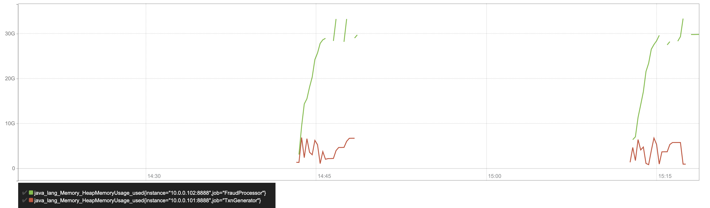

# Iteration 1

A very simplistic FraudDetection implementation was created (no Hazelcast yet)
and the transaction generator and server were run locally. It was observed that,
on occasion, the fraud detection server fail to read transactions even after a
connection was established and, at the same time, the transaction generator was successfully
writing to the channel.  A few changes were made to the fraud detection server
and transaction generator until they worked consistently in a local environment.

See [this commit](https://github.com/wrmay/Hazelcast-certification/commit/a58f72472ed5195cfc6e8f3ed4678c0087491d09).

# Iteration 2

Provisioning of an AWS environment was automated using [Cloudlab](https://pypi.org/project/cloudlab/)
and Ansible (see the "cloudlab" folder). The instance types selected were
m5.4x large (16 vCPUs, 64G RAM). A 5 minute run was performed.   


Observations from this run:  

- The provided fraud detection server prints throughput numbers every 3 seconds.  
The observed throughputs ranges from more than 200k/second to less than 10k/second.
Typical throughput was probably around 100k/second but its difficult to tell.
- it's hard to summarize the performance of a run concisely, add some metrics
to summarize the whole to make it easy to compare runs.  
- The wide range of through puts observed is almost certainly due to gc.  Need to
add a way to observe gc activity and also make a pass through the code looking for
simple ways to reduce the garbage produced (e.g. object pools).

# Iteration 3

Prometheus + JMX based monitoring was added to the lab setup.  Some more changes were made on the fraud detection server to reliably print the overall throughput at the end of the run.

Based on the JMX instrumentation, it became rather clear that even a 32G JVM was filling up during the run.  We can see in the graphs below that gc is not able to reclaim much memory.  The lower graph is the transaction generator, the upper is the fraud detection server.



Its not immediately obvious what this is since even 30 million txn objects should consume something closer to 3G .  "jmap -histo:live" reveals the following:

```
 num     #instances         #bytes  class name
----------------------------------------------
   1:      15407881    12694907040  [Ljava.lang.Object;
   2:     151437293     7078157960  [C
   3:     151437266     4845992512  java.lang.String
   4:      21618624     1902438912  com.hazelcast.certification.domain.Transaction
   5:      15407389      739554672  java.util.HashMap$Node
   6:      15406347      616253880  java.util.ArrayList
   7:           161      268478120  [Ljava.util.HashMap$Node;
sun.util.resources.LocaleData$LocaleDataResourceBundleControl

--- SNIP --

Total     370832846    28155703248
```

Since analyzing a 32G heap dump is *very* resource intensive, the experiment was repeated with a small heap which was then analyzed using JVisualVM.  

Heap analysis showed that this was the result of a poor choice of data structure for holding the transaction history and specifically that a 100 element array list was allocated to hold the transaction history for each card.  The Object [] instances backing the ArrayLists were taking up about 50% of the heap.  Oops!

```java
public class SimpleFraudDetection extends FraudDetection  {

    private final static ILogger log = Logger.getLogger(SimpleFraudDetection.class);

    private Map<String, List<Transaction>> cardHistory  = new HashMap<String, List<Transaction>>(30000000);


    // this thing is not thread safe - which is OK for now
    protected void handle(Transaction t) {
        List<Transaction> txnList = cardHistory.get(t.getCreditCardNumber());
        if (txnList == null){
          
          	/*** THE CULPRIT BELOW ***/
            txnList = new ArrayList<Transaction>(100);  
            cardHistory.put(t.getCreditCardNumber(), txnList);
        }

        // should at least use a pool so we don't keep newing this over and over
        RuleEngine re = new RuleEngine(t, txnList);
        re.executeRules();
        registerResult(new Result(t.getCreditCardNumber(), re.isFraudTxn()));

        txnList.add(t);
    }


}

```

Changing this data structure to a LinkedList and not pre-sizing resulted in a slightly better run.  Best result to date:

```
Transactions Processed: 31729093
Elapsed time: 301s
Overall TPS is: 105129
```

This tells us that a single thread should be able to perform about 100k fraud detection operations/sec.

Drawbacks of this solution:

- More credit cards requires a larger fraud processor JVM. We are probably close to the practical limit with 30 million cards.
- It's not fault tolerant
- The fraud detection server is a single thread.  It doesn't scale up.
- It is not fault tolerant.

Time for Hazelcast.

In the next iteration, the fraud detection process and the card histories will be hosted in Hazelcast. The initial design will be

- TBD