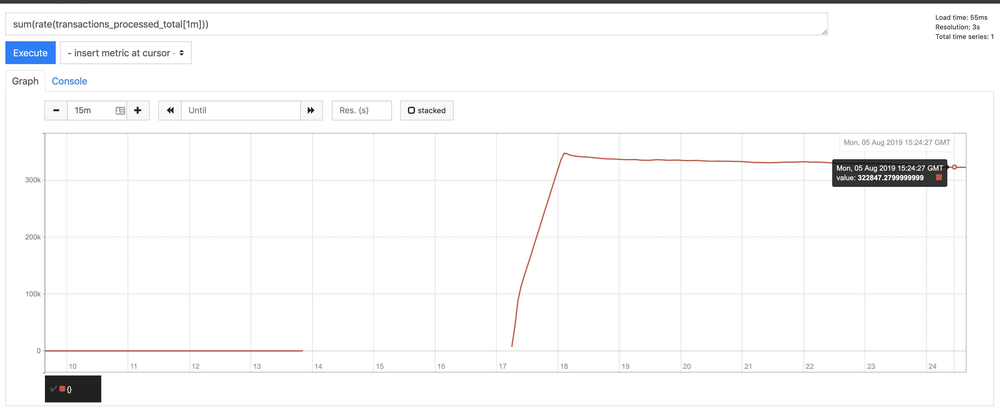

# Contents

This document describes the primary findings.  Many tests were run on AWS infrastructure.  To faciliate rapid test cycles, reusable machinery was developed.  It should be possible for anyone to quickly duplicate these results using the same machinery.  For instructions on that, see [USAGE.md](USAGE.md).

The raw details of each test run can be found in [TEST_RESULTS.md](TEST_RESULTS.md).

Various related side inquiries were documented [here](INVESTIGATIONS.md) and [here](https://github.com/wrmay/threads-and-events).

# Certification Problem Overview

The problem is to build a system that scores credit card transactions using the provided rule engine and transaction generation code.  

_Based on the [original project](https://github.com/hazelcast/hazelcast-certification), the challenge has been implemented  as a streaming" system, not a request-response system._ In other words, there is no "scoring service".  Instead, as in the original solution, transactions are pulled from a transaction source, evaluated for fraud and the result is recorded within the system.

The following additional requirements are also understood:

- The solution must be fault tolerant.  This is of course the source of much difficulty.  The original system is very fast and efficient but it does not back up its data anywhere so it is not fault tolerant.
- The solution must be scalable both in terms of the number of credit cards in the system and the capacity to score transactions.  Again, the original solution is restricted to one machine and does not have these qualities.

# Solution Architecture


1. The central data structure is the "transaction_history" map.  The key is credit card number and the value is a LinkedList<Transaction> comprising the credit card's recent transaction history.  The [original transaction generator](hazelcast-certification/src/main/java/com/hazelcast/certification/util/TransactionsUtil.java) has been incorporated into a [map loader](hazelcast-certification/src/main/java/com/hazelcast/certification/util/TransactionMapLoader.java).  This is used to load the history in a distributed manner.  30 million credit cards with 20 historical transactions each takes a few minutes to load using this approach.
2. Each [hazelcast member](hazelcast-certification/src/main/java/com/hazelcast/certification/server/FraudDetectionServer.java) is also running a configurable number of [transaction reader threads](hazelcast-certification/src/main/java/com/hazelcast/certification/server/TransactionSource.java)that pull a transaction from the [transaction source](hazelcast-certification/src/main/java/com/hazelcast/certification/util/TransactionsGenerator.java), ascertains the credit card number, and invokes an [entry processor](hazelcast-certification/src/main/java/com/hazelcast/certification/server/ProcessTransactionEntryProcessor.java) on the appropriate key.
3. The  [entry processor](hazelcast-certification/src/main/java/com/hazelcast/certification/server/ProcessTransactionEntryProcessor.java) does the following.  Obtain the transaction history from the "transaction_history" map. Execute the rule engine.  Record the result (fraudulent or not) back onto the transaction along with a timestamp and the rule that it failed on.  The newest transaction is added to the list and the oldest is removed.
4. To ascertain the throughput, a [fast aggregator](hazelcast-certification/src/main/java/com/hazelcast/certification/util/StatsAggregator.java) is used.  It scans all transaction histories in reverse order, accumulating the number of transactions scored and stopping when it reaches a transaction that was scored more than 10 seconds ago.  On the full 30 million cards (each with 20 historical transactions) this runs in a few seconds with no obvious impact on CPU. 

__Additional Optimization and Notes__

- The most important architectural priority was to use Entry Processors.  The main idea is to have the workload run within entry processors because of the following benefits:  
  - all data access is local
  - even the data that changes does not have to be replicated thanks to backup entry processors.
  - the work will automatically leverage the data colocated work queues and thread pools built into the Hazelcast partition threading model.  The number of independent worker threads can be set directly using the "hazelcast.operation.thread.count" property.
- The data in the transaction history is stored in OBJECT format to avoid repeated serialization / deserialization of the large transaction history lists.  HD memory was not used because  the cost of deserializing the whole transaction list to process one transaction was assumed to be too high.  Also, in the current solution there is no sign of GC stress.
- Use of Entry Processors precluded storing the data in a MultiMap, something which I otherwise would have considered.
- _The transaction history is kept to a constant length._  All of the transactions generated by the transaction generator are in the last 90 days.  Although it would not be a problem in a real system, in this exercise, if the 90 day guideline were strictly followed it would result in unbounded growth of the list of transactions that must be evaluated to score a transaction. _Growth from new customers can be handled by adding capacity  but having the work required to score one transaction grow unbounded would probably not be acceptable to anyone._ To address this issue,  as new transactions are added to the end, old transactions are removed from the beginning.  Fixing the size of the history is necessary to avoid having the work required to score a card grow in a completely unbounded fashion.  
- Transactions are kept in String format as long as possible to minimize additional serialization and deserialization.  Specifically, tranactions are sent to the entry processor as Strings not Transaciton objects.
- The representation of the [Transaction](https://github.com/wrmay/Hazelcast-certification/blob/master/hazelcast-certification/src/main/java/com/hazelcast/certification/domain/Transaction.java) is optimized.  Storing a lot of short strings is very inefficient.  Even an empty java String can consume 15 bytes.  Since the transactions in this system number in the hundreds of millions, some special attention for Transactions is justified.  All of the String fields (which are fixed width) are combined into a single byte array.  Getters and setters are used to pack and unpack the appropriate portion of the byte array.  [Tests](hazelcast-certification/src/test/java/TransactionTest.java) were added to ensure that this scheme actually worked correctly.  In the process, some flaws in the provided transaction generation code were discovered and corrected.  _This approach reduced the memory requirement for 2 copies of transaction data from 32G per million transactions to 8G per million_.  Note that these numbers were obtained by observing the overall memory usage of a loaded and running JVM.  They include the memory for storing transactions but they also include uncollected garbage, JVM working space and other overhead.  In other words, the numbers cannot necessarily be used to compute the in memory size of a transaction (only an upper bound).
- The [rule engine](hazelcast-certification/src/main/java/com/hazelcast/certification/business/ruleengine/RuleEngine.java) has been modified with "short circuiting" logic.  Once a transaction is determined to be fraudulent based on one rule, the subsequent rules are not executed since they could not change the outcome.
- The throughput of the system was very sensitive to  the balance of partition threads (hazelcast.operation.thread.count) vs. transaction reader threads.  Trial and error was required to find a good balance.

- Also, here are the statistics on history map during a run.

  

  _Note there are no gets!_. This is because we are using entry processors and aggregators  to send the processing to the data.  That data does not need to be fetched by anyone.

__Instrumentation__

_Prometheus_ was used for instrumentation.  Using the _Prometheus_ java client, a custom counter was exposed to count transactions processed.  Note that care was taken to count only the execution of the primary entry processor and to exclude execution of the backup entry processor.

JVM and operating system metrics are exposed via the _Prometheus_ JMX exporter.  

All metrics are collected into a central _Prometheus_ server running on the same machine as the Hazelcast Management Server.

__Provisioning and Configuration__

Provisioning of the servers on AWS is automated using [cloudlab](https://github.com/wrmay/cloudlab), a tool written by the author.  Installation and configuration of Hazelcast IMDG and Prometheus is performed via an Ansible [playbook](cloudlab/setup.yaml).  All processes are daemonized via [supervisord](http://supervisord.org).


# Infrastructure

__Volume:__ 30 million cards, each with 20  transactions.

__Infrastructure__: m5.2xlarge instances running on AWS.  Each has 32G RAM and 8 vcpus (4 real cores, 8 hyperthreads)

__JVM Settings__: -Xms28g -Xmx28g -Xmn4g -XX:+UseParNewGC -XX:+UseConcMarkSweepGC (note that CompressedOOPs is enabled by default).

# Results 

The table below shows the results of testing several alternatives at different scales.  The units are all thousands of transactions per second.  Detailed results, throughput, CPU and heap utiulization for each  run can be found in [a separate document](TEST_RESULTS.md).	

| Nodes | Base Architecture | Base + 1031 partitions and 128 readers | Base + 2063 partitions and 192 readers | Base + EP Pipelining | Base +Network Batching | Base +EP Pipelining and Network Batching |
| ----- | ----------------- | -------------------------------------- | -------------------------------------- | -------------------- | ---------------------- | ---------------------------------------- |
| 8     | 102               |                                        |                                        | 138                  | 97                     | 193                                      |
| 10    | 113               |                                        |                                        |                      |                        |                                          |
| 12    | 124               |                                        |                                        | 156                  | 115                    | 267                                      |
| 14    | 116               |                                        |                                        |                      |                        |                                          |
| 16    | 138               | 140                                    | 153                                    | 166                  | 141                    | **323**                                  |
| 18    |                   |                                        |                                        |                      |                        |                                          |
| 20    |                   |                                        |                                        | 170                  | 161                    | *                                        |

The initial series of tests yielded fairly good results with 138 TPS on 16 servers.  However, this architecture showed  scaling problems and it did not use all of the available CPU.  The chart below shows the throughput measured on the base architecture runs fitted with a quadratic trend line (see also the [results spreadsheet](results.xlsx)).  As can be seen, the trend line flattens out at around 16 servers so no further benefit would be expected from adding servers.


This chart shows the CPU utilization during the 16 node test run.


Since most of the work is done on partition threads, dramatically increasing both the number of partitions and the number of partition threads was tried.  A [side investigation](https://github.com/wrmay/threads-and-events) was also conducted which indicated that the cost of thread context switching on a JVM is quite low.   This yielded a throughput of 153k TPS but CPU utilization did not increase dramatically indicating some other limiting factor.  

__Round 2__

Each transaction is scored by invoking an entry processor using the `IMap.executeOnKey` method.  While the entry is waiting to be processed, the caller thread can do nothing but wait.  Ideally it would do some useful work like reading the next transaction. In theory, this could be addressed by simply increasing the number of threads.  The idea being that while one thread is waiting the JVM will select and execute another thread. However, as can be seen in the 3rd and 4th columns in the table above, the results of this approach were not dramatic.

To address this, the architecture was revised to perform "entry processor pipelining".  Instead of each transaction reader thread synchronously invoking an entry processor, the transaction readers were modified to call "submitToKey" with a callback.  A (non-distributed) blocking queue of finite capacity was used limit the number of transactions that could be "in flight".  See the code blocks below.

BEFORE

```java
    private void process() {
        String rawTxnString = new String(buffer, encoding);
        int z = rawTxnString.indexOf(0);
        String txnString = rawTxnString.substring(0, z);
        int i = txnString.indexOf(",");
        String ccNumber = txnString.substring(0, i);
        txnHistory.executeOnKey(ccNumber, new ProcessTransactionEntryProcessor(txnString));
    }

```

AFTER

```java
 private void process() {
        String rawTxnString = new String(buffer, encoding);
        int z = rawTxnString.indexOf(0);
        String txnString = rawTxnString.substring(0, z);
        int i = txnString.indexOf(",");
        String ccNumber = txnString.substring(0, i);
        try {
            inFlightTransactions.put(txnString);  // blocks to provide back pressure
        } catch(InterruptedException ix){
            log.severe("Unexpected Exception");
        }
        txnHistory.submitToKey(ccNumber,new ProcessTransactionEntryProcessor(txnString), new EntryStoredCallback(txnString));
        transactionsSubmitted.inc();
    }
```

Also, two transaction servers were used for the 12 and 16 node runs, and 3 for the 20 node run.  This was done to eliminate the concern that the single threaded transaction servers would max out.

At 8 servers, this architecture matched the base architecture throughput of 138k TPS with 16 servers.  However, at higher scale, only a modest improvement was observed  with 166k TPS on 16 nodes and 170k TPS on 20 nodes. Note that the last 4 servers only increased throughput by 4K TPS.


__Round 3__

The results up to this point seem to  indicate some limiting resource.  The problem itself is "embarrasingly parallel" and the architecure is set up to exploit it.  The author was very confident that there were no fundamental architectural flaws.  The only other shared resources seem to be the transaction generator itself and the network.  The possibility of the single threaded transactions server becoming a limiting factor was mitigated (even in round 2) by running multiple.  

`iperf3` was used to test network throughput which tested above 10 Mbits/second or about 1.2G bytes/second.  The image below shows the AWS metrics for one of the servers during a high load test run.


It was noticed that, while utilization was high, at roughly .7 G bytes/second, it was not necessarily at capacity.  The other interesting thing is that, comparing the network throughput in bytes and in packets, one can see that _each packet is only about 230 bytes_.  At this size, a large portion of the packet is consumed with packet headers.

The way that the application used the network was then scrutinized. The reason for the small packets is as follows.   Each [transaction reader thread](hazelcast-certification/src/main/java/com/hazelcast/certification/server/TransactionSource.java) reads 100 bytes (the size of one transaction) and then processes it using an entry processor.  The network stack will fill the socket buffer and then 100 bytes will be consumed, leaving 100 bytes room in the buffer.  Unless the bytes are consumed as fast as they can be delivered, the consumer will send a 100 byte TCP window and the sender will "throttle back" accordingly.  This means that the sender will only send 100 bytes before waiting for an acknowledgement.  The network round trip time was measure at around .15ms (see [INVESTIGATIONS.md](INVESTIGATIONS.md)) but 100 bytes / .15ms = 100 / .00015 = 667k bytes a second on each socket and also 6.7k  transactions per second on each reader thread.  Even though the small TCP window is bad, the math here does not suggest that the TCP window is the direct cause but the small packets are a problem for another reason.  

Getting back to the shared resource hypothesis, _it is theorized that the infrastructure effectively has a speed limit in terms of packets/second (not bytes/second)_ .  Examples of potential sources include a firewall that has to examine each packet or intentional packets/second rate limiting enforced by the AWS infrastructure.  _On this theory, the transaction reader was modified to pull 100 transactions worth of bytes at a time._  This allows the network to send more than 100 bytes in each packet.  With 100x more data being sent in each packet, any "packets per second" speed limit will be avoided or at least deferred.  The source code for this modification is below (compare to the same method above - the only addition is the "for"  loop).

```java
    private void process() {
        for (int offset = 0;  (offset + TRANSACTION_SIZE) <= BUFFER_SIZE; offset += TRANSACTION_SIZE){
            String rawTxnString = new String(buffer,offset, TRANSACTION_SIZE,encoding);
            int z = rawTxnString.indexOf(0);
            String txnString = rawTxnString.substring(0, z);
            int i = txnString.indexOf(",");
            String ccNumber = txnString.substring(0, i);
            try {
                inFlightTransactions.put(txnString);  // blocks to provide back pressure
            } catch(InterruptedException ix){
                log.severe("Unexpected Exception");
            }
            txnHistory.submitToKey(ccNumber,new ProcessTransactionEntryProcessor(txnString), new EntryStoredCallback(txnString));
            transactionsSubmitted.inc();
        }
    }

```

The results were dramatic!


_Throughput went all the way to 193k TPS on 8 servers, adding 4 more servers gains 69K TPS and the next 4 adds 56K TPS for a high TPS of 323K TPS on 16 servers.  Although this is not linear, it is certainly much closer.  Furthermore, the problem has become CPU bound, a clear indicator that there had been a network related bottleneck before._


__Going Further__

A very interesting thing was observed for the 20 node test using this architecture.  Below are the throughput , CPU and memory graphs for that test.


For comparison, here is the throughput graph from the 16 node test.



It can be seen that the "waves" have a 150 second period , that all servers are affected at the same time, and that the waves do not correspond to garbage collection activity.  It is theorized that this is some sort of rate limit enforced by the AWS infrastructure but it has not been investigated any further at this time.

# A Note About Fault Tolerance

The solution stores all of the transaction history in a redundant map but if a server is lost, transactions that have been read from the source and not yet scored will be lost.  With the base line architecture, each reader thread can have 1 transaction in flight.  With the later architectures, many more transactions can be in flight.  

This is unavoidable with the problem as posed.  The cluster members must pull the transactions from the transaction source and even saving the transactions into a replicated data structure before processing would not solve the problem.  With a "push", if the recipient fails to receive for any reason, it becomes the responsibility of the "pusher" to retry.  With the pull architecture, if the "puller" fails there is no one to retry and the pulled event is lost.

The best way to handle this in a real system if for the source to be "replayable".  This is of course exactly the approach implemented by Kafka and other Enterprise event streaming solutions.  Also, it is worth noting that source replayability is a requirement for reliable event processing in Jet. 

