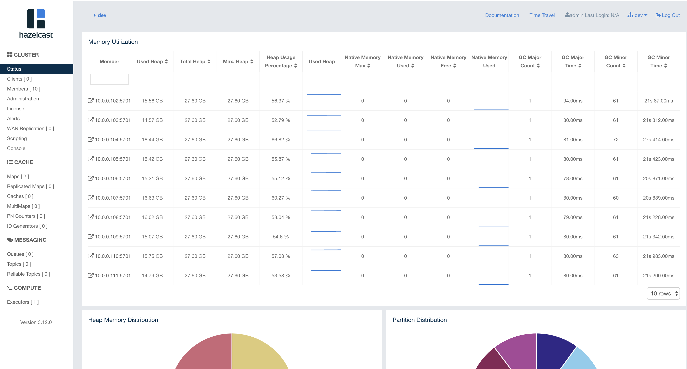

# Certification Problem Overview

The problem is to build a system that scores credit card transactions using the provided rule engine and transaction generation code.  

_Based on the [original project](https://github.com/hazelcast/hazelcast-certification), the challenge has been implemented  as a streaming" system, not a request-response system._ In other words, there is no "scoring service".  Instead, as in the original solution, transactions are pulled from a transaction source, evaluated for fraud and the result is recorded within the system.

The following additional requirements are also understood:

- The solution must be fault tolerant.  This is of course the source of much difficulty.  The original system is very fast and efficient but it does not back up its data anywhere so it is not fault tolerant.
- The solution must be scalable both in terms of the number of credit cards in the system and the capacity to score transactions.  Again, the original solution is restricted to one machine and does not have these qualities.

# Solution Architecture


1. The central data structure is the "transaction_history" map.  The key is credit card number and the value is a LinkedList<Transaction> comprising the credit card's recent transaction history.  The [original transaction generator](hazelcast-certification/src/main/java/com/hazelcast/certification/util/TransactionsUtil.java) has been incorporated into a [map loader](hazelcast-certification/src/main/java/com/hazelcast/certification/util/TransactionMapLoader.java).  This is used to load the history in a distributed manner.  30 million credit cards with 20 historical transactions each takes a few minutes to load using this approach.
2. Each [hazelcast member](hazelcast-certification/src/main/java/com/hazelcast/certification/server/FraudDetectionServer.java) is also running a configurable number of [transaction reader threads](hazelcast-certification/src/main/java/com/hazelcast/certification/server/TransactionSource.java)that pull a transaction from the [transaction source](hazelcast-certification/src/main/java/com/hazelcast/certification/util/TransactionsGenerator.java), ascertains the credit card number, and invokes an [entry processor](hazelcast-certification/src/main/java/com/hazelcast/certification/server/ProcessTransactionEntryProcessor.java) on the appropriate key.

3. The  [entry processor](hazelcast-certification/src/main/java/com/hazelcast/certification/server/ProcessTransactionEntryProcessor.java) does the following.  Obtain the transaction history from the "transaction_history" map. Execute the rule engine.  Record the result (fraudulent or not) back onto the transaction along with a timestamp and the rule that it failed on.  The newest transaction is added to the list and the oldest is removed.
4. To ascertain the throughput, a [fast aggregator](hazelcast-certification/src/main/java/com/hazelcast/certification/util/StatsAggregator.java) is used.  It scans all transaction histories in reverse order, accumulating the number of transactions scored and stopping when it reaches a transaction that was scored more than 10 seconds ago.  On the full 30 million cards (each with 20 historical transactions) this runs in a few seconds with no obvious impact on CPU.

__Additional Optimization and Notes__

- The most important architectural priority was to use Entry Processors.  The main idea is to have the workload run within entry processors because of the following benefits:  
  - all data access is local
  - even the data that changes does not have to be replicated thanks to backup entry processors.
  - the work will automatically leverage the data colocated work queues and thread pools built into the Hazelcast partition threading model.  The number of independent worker threads can be set directly using the "hazelcast.operation.thread.count" property.
- The data in the transaction history is stored in OBJECT format to avoid repeated serialization / deserialization of the large transaction history lists.  HD memory was not used because it was judged that the cost of deserializing the whole transaction list to process one transaction was assumed to be too high.  Also, in the current solution there is no sign of GC stress.
- Use of Entry Processors precluded storing the data in a MultiMap, something which I otherwise would have considered.
- _The transaction history is kept to a constant length._  As new transactions are added to the end, old transactions are removed from the beginning.  Fixing the size of the history is necessary to avoid having the work required to score a card grow in a completely unbounded fashion.  Growth from new customers can be handled by adding capacity  but having the work required to score one transaction grow unbounded would probably not be acceptable to anyone.
- The representation of the [Transaction](https://github.com/wrmay/Hazelcast-certification/blob/master/hazelcast-certification/src/main/java/com/hazelcast/certification/domain/Transaction.java) is optimized.  Storing a lot of short strings is very inefficient.  Even an empty java String can consume 15 bytes.  Since the transactions in this system number in the hundreds of millions, some special attention for Transactions is justified.  All of the String fields (which are fixed width) are combined into a single byte array.  Getters and setters are used to pack and unpack the appropriate portion of the byte array.  [Tests](hazelcast-certification/src/test/java/TransactionTest.java) were added to ensure that this scheme actually worked correctly.  In the process, some flaws in the provided transaction generation code were discovered and corrected.  _This approach reduced the memory requirement for 2 copies of transaction data from 32G per million transactions to 8G per million_.  Note that these numbers were obtained by observing the overall memory usage of a loaded and running JVM.  They include the memory for storing transactions but they also include uncollected garbage, JVM working space and other overhead.  In other words, the numbers cannot necessarily be used to compute the in memory size of a transaction (only an upper bound).
- The [rule engine](hazelcast-certification/src/main/java/com/hazelcast/certification/business/ruleengine/RuleEngine.java) has been modified with "short circuiting" logic.  Once a transaction is determined to be fraudulent based on one rule, the subsequent rules are not executed since they could not change the outcome.

# Results Overview

The best results obtained so far are summarized below.

__Volume:__ 30 million cards, each with 20  transactions.

__Infrastructure__: 10  m5.2xlarge instances running on AWS.  Each has 32G RAM and 8 vcpus (4 real cores, 8 hyperthreads)

__JVM Settings__: -Xms28g -Xmx28g -Xmn4g -XX:+UseParNewGC -XX:+UseConcMarkSweepGC (note that CompressedOOPs is enabled by default).

__Throughput:__ ~ 130k TPS

__Utilization:__ Heap on all servers around 14G / 28G.  CPU varied significantly over time, generally in the 30% - 70% range.

# Instructions

This project includes a dev/ops component for provisining an AWS environment.  The configuration related artifacts are all in the `cloudlab` directory.  It uses the [cloudlab](https://github.com/wrmay/cloudlab) open source project.  Cloudlab in turn uses the AWS cli.

### Prerequisites

- python 3
- [cloudlab](https://github.com/wrmay/cloudlab)
- an AWS account with appropriate limits
- A configured AWS CLI.  If it is installed, type "aws configure" to configure it with your credentials.
- [Ansible](https://docs.ansible.com/ansible/latest/installation_guide/index.html).

_Also, put your license in `cloudlab/resources/ClusterMember/hazelcast.xml`_

### Walk Through

_All instructions below presume that the working directory is "cloudlab"._

```
cd cloudlab
```


Review the `cloudlab/cloudlab_config.yaml` file to see what is being provisioned.  When you are ready, provision your servers on AWS.  The example below provisions an environment named "rmtest".

```bash
cloudlab mkenv rmtest
```


Now set them up using Ansible.

```
./runplay.sh rmtest setup
```

At this point, if there are no errors, you should have a running Hazelcast cluster.  The script should print out the management center URL.  Pull up management center, configure security and your license and review the cluster to make sure everything looks as expected.

The transaction history is not loaded at this point.  Load the history with the following command. It will take a few minutes.   Note that the output is a bit noisy.  Look for "load started".

```
./controller.sh rmtest load
```

Follow the progress with management center and when it is done, verify that the expected number of entries are in the "transaction_history" map.  





Now start processing transactions (be sure to replace "rmtest" with the name of your environment).

```
./controller.sh rmtest start processing

```

Obviously, there will be a dramatic increase in CPU utilization.


Also, note the statistics on the history map.


_Note there are no gets!_. This is because we are using entry processors and aggregators  to send the processing to the data.  That data does not need to be fetched by anyone.

Lastly, you can observe how the throughput using an aggregator to count all of the items that have been scored in the last 10 seconds.  The throughput is reported as count / 10.

```
./controller.sh rmtest report throughput
```


Again, the output is noisy.  See the excerpt below with the relevant information indicated by ">>>>".

```
Jul 11, 2019 4:37:26 PM com.hazelcast.core.LifecycleService
INFO: hz.client_0 [dev] [3.12] HazelcastClient 3.12 (20190409 - f68a315, 915d83a) is CLIENT_CONNECTED
Jul 11, 2019 4:37:26 PM com.hazelcast.internal.diagnostics.Diagnostics
INFO: hz.client_0 [dev] [3.12] Diagnostics disabled. To enable add -Dhazelcast.diagnostics.enabled=true to the JVM arguments.
>>>> throughput over the last 10s: 133641 tps
Jul 11, 2019 4:37:31 PM com.hazelcast.core.LifecycleService
INFO: hz.client_0 [dev] [3.12] HazelcastClient 3.12 (20190409 - f68a315, 915d83a) is SHUTTING_DOWN
Jul 11, 2019 4:37:32 PM com.hazelcast.client.connection.ClientConnectionManager
INFO: hz.client_0 [dev] [3.12] Removed connection to endpoint: [10.0.0.111]:5701, connection: ClientConnection{alive=false, connectionId=1, channel=NioChannel{/192.168.1.138:52697->ec2-52-15-164-57.us-east-2.compute.amazonaws.com/52.15.164.57:5701}, remoteEndpoint=[10.0.0.111]:5701, lastReadTime=2019-07-11 16:37:31.166, lastWriteTime=2019-07-11 16:37:26.395, closedTime=2019-07-11 16:37:31.172, connected server version=3.12}
Jul 11, 2019 4:37:32 PM com.hazelcast.core.LifecycleService
INFO: hz.client_0 [dev] [3.12] HazelcastClient 3.12 (20190409 - f68a315, 915d83a) is SHUTDOWN
```

You can also verify the activity to some extent by logging onto the transaction generator machine and tailing the log file.

First, figure out which machine it is:

```
cat rmtest/inventory.ini
...
[TxnGenerator]
52.14.73.169

[ClusterMember]
3.16.91.9
...
# the transaction generator public IP is 52.14.73.169
```


Now log on using ssh and tail the log file.

```
ssh -i rmtest/rmtest.pem ec2-user@52.14.73.169
....
# now on the transaction generator
tail -f txngenerator.stderr.log

...
INFO: sending txn number 129290000
Jul 11, 2019 8:43:17 PM com.hazelcast.certification.util.TransactionsGenerator
INFO: sending txn number 129300000
Jul 11, 2019 8:43:17 PM com.hazelcast.certification.util.TransactionsGenerator
INFO: sending txn number 129310000
Jul 11, 2019 8:43:17 PM com.hazelcast.certification.util.TransactionsGenerator

# each line of output is 10K transactions dispensed
```


__When you are done, don't forget to deprovision the environment!__

```
cloudlab rmenv rmtest
```


END OF WALK THROUGH

### Configuration File Reference

#### cloudlab/cloudlab_config.yaml

This file defines the AWS environment.  An example is below.

```yaml
---
  region: us-east-2
  servers:
    - instance_type: m5.2xlarge
      private_ip_addresses: [101]
      roles:
        - TxnGenerator

    - instance_type: m5.2xlarge
      private_ip_addresses: [102,103,104,105,106,107,108,109,110,111]
      roles:
        - ClusterMember

    - instance_type: m5.2xlarge
      private_ip_addresses: [222]
      roles:
        - Prometheus
        - ManCenter

  open_ports:
    TxnGenerator: [8511, 8888]
    ClusterMember: [8888, 5701]
    Prometheus: [9090, 3000]
    ManCenter: [8080]

```


Note the AWS region at the top and the instance types throughout. Each group of servers is assigned private IP addresses in the 10.0.0.* subnet.  The "roles" key specifies logical roles that will be written into an Ansible inventory file after provisioning.  For example, the above configuration file would cause 10 m5.2xlarge "Cluster Members" to be provisioned in US East along with a "TxnGenerator" and a "Prometheus/Mancenter" server.  The private IP addresses of the cluster members would be 10.0.0.102 - 10.0.0.111.  The resulting inventory file might look like the one below.

```ini
52.14.73.169  private_ip=10.0.0.101 dns_name=ec2-52-14-73-169.us-east-2.compute.amazonaws.com
3.16.91.9  private_ip=10.0.0.102 dns_name=ec2-3-16-91-9.us-east-2.compute.amazonaws.com
18.223.162.203  private_ip=10.0.0.103 dns_name=ec2-18-223-162-203.us-east-2.compute.amazonaws.com
18.221.133.228  private_ip=10.0.0.104 dns_name=ec2-18-221-133-228.us-east-2.compute.amazonaws.com
18.221.20.121  private_ip=10.0.0.105 dns_name=ec2-18-221-20-121.us-east-2.compute.amazonaws.com
18.223.44.51  private_ip=10.0.0.106 dns_name=ec2-18-223-44-51.us-east-2.compute.amazonaws.com
18.223.21.154  private_ip=10.0.0.107 dns_name=ec2-18-223-21-154.us-east-2.compute.amazonaws.com
18.220.189.101  private_ip=10.0.0.108 dns_name=ec2-18-220-189-101.us-east-2.compute.amazonaws.com
18.223.149.150  private_ip=10.0.0.109 dns_name=ec2-18-223-149-150.us-east-2.compute.amazonaws.com
18.220.248.158  private_ip=10.0.0.110 dns_name=ec2-18-220-248-158.us-east-2.compute.amazonaws.com
52.15.164.57  private_ip=10.0.0.111 dns_name=ec2-52-15-164-57.us-east-2.compute.amazonaws.com
18.223.118.69  private_ip=10.0.0.222 dns_name=ec2-18-223-118-69.us-east-2.compute.amazonaws.com

[TxnGenerator]
52.14.73.169

[ClusterMember]
3.16.91.9
18.223.162.203
18.221.133.228
18.221.20.121
18.223.44.51
18.223.21.154
18.220.189.101
18.223.149.150
18.220.248.158
52.15.164.57

[Prometheus]
18.223.118.69

[ManCenter]
18.223.118.69
```


#### cloudlab/resources/ClusterMember/hazelcast.xml

This file is used to initialize all Hazelcast cluster members.  It also contains configuration for the Map Loader including the number of credit cards to preload.

#### cloudlab/resources/TxnGenerator/FraudDetection.properties

This file incudes the port that the transaction source will listen on as well as the number of credit cards for which to generate transactions.  _This last setting must be kept in sync with the Map Loader configuration._

#### cloudlab/local-hazelcast-client-xml.j2

This is a template that is used to generate cloudlab/ENVNAME/hazelcast-client.xml (see below).

#### cloudlab/ENVNAME/aws-cloud-template.yaml

This file is generated when the environment is provisioned.  ENVNAME is a place holder.  You provide the environment name when you provision the environment.  

This file is the AWS cloud formation template that is used to provision the servers and network resources on AWS.

#### cloudlab/ENVNAME/hazelcast-client.xml

This is the hazelcast client configuration that will be used by the controller program to connect to the running cluster from the local environment.

#### cloudlab/ENVNAME/inventory.ini

This is an Ansible inventory file.  It contains information that is used by Ansible playbooks to connect to and set up the servers on AWS.

#### cloudlab/ENVNAME/ENVNAME.pem

All access to the AWS servers is via passwordless SSH.  This includes Ansible.  This file is the private key required to access the servers in the environment. Each environment has its own unique key. _No one can SSH onto the servers in this environment without this key_.
