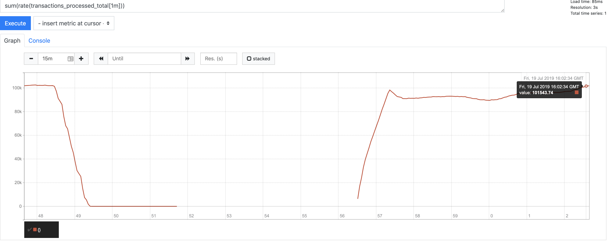
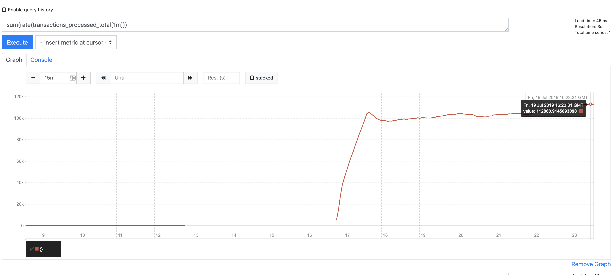
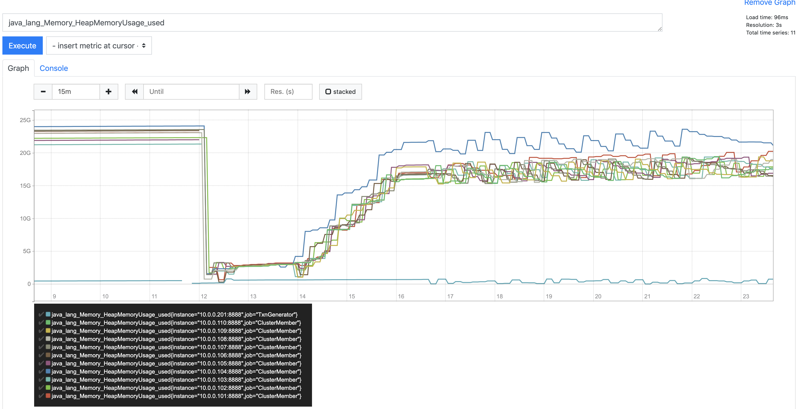
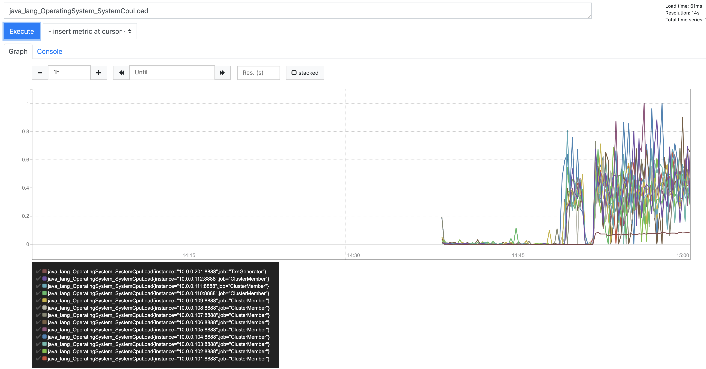
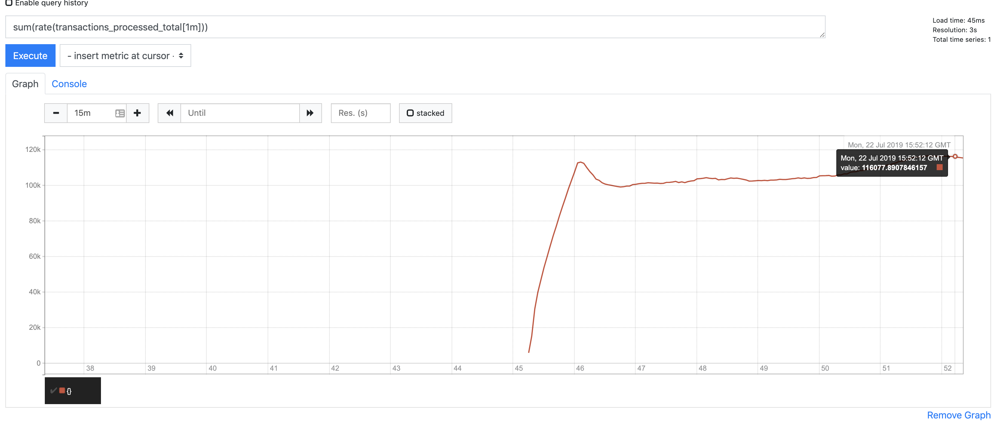
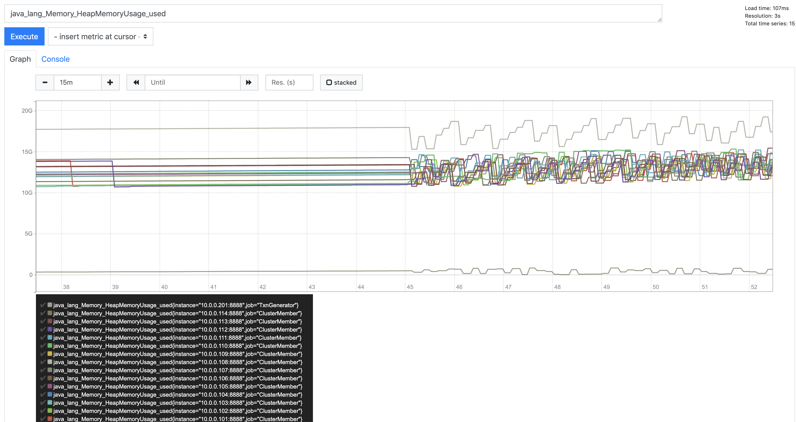
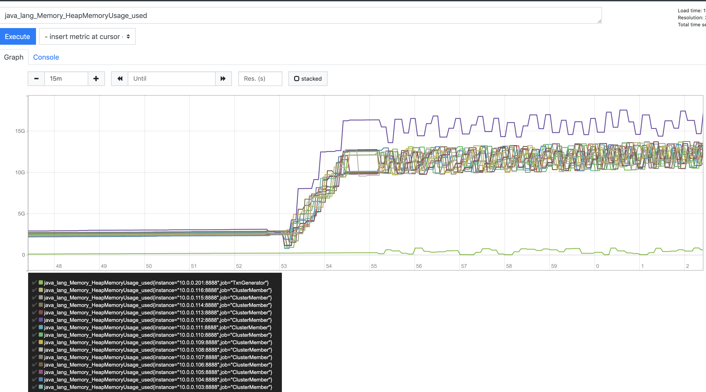

# Details of Scaling Experiment

### 8 Nodes

_throughput_

_CPU_

_Heap Memory_

### 10 Nodes

_throughput_

_CPU_

_Heap Memory_

### 12 Nodes

_throughput_

_CPU_

_Heap Memory_

### 

### 14 Nodes

_throughput_

_CPU_

_Heap Memory_

### 16 Nodes

_throughput_

_CPU_

_Heap Memory_

### 
