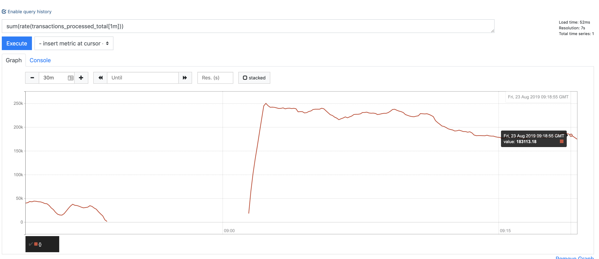
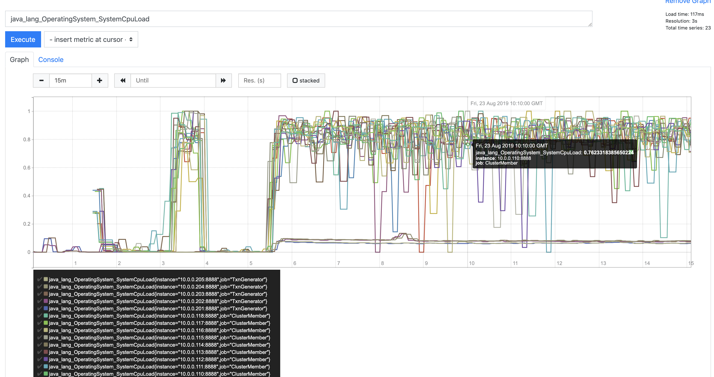

# Details of Scaling Experiment - Continued

## Base Architecture + EP Pipelining + Network Level Batching + Strict 90 day Enforcement (with violent purge)

### 6 nodes

_throughput_

_CPU_

_Heap_

### 12 Nodes

_throughput_

_CPU_

_Heap_

### 18 Nodes

_throughput_

_CPU_

_Heap_

## Base Architecture + EP Pipelining + Network Level Batching + Strict 90 day Enforcement (a with clean as you go)

### 6 nodes

_throughput_

_CPU_

_Heap_

### 12 Nodes

_throughput_

_CPU_

_Heap_

### 18 Nodes

_throughput_

_CPU_

_Heap_

## Base Architecture + EP Pipelining + Network Level Batching + Strict 90 day Enforcement (a with clean as you go) + HD

### 6 nodes

_throughput_

_CPU_

_Heap_

### 12 Nodes

_throughput_

_CPU_

_Heap_

### 18 Nodes

_throughput_

_CPU_

_Heap_

